# Counter service
This repo is for the counter service Python app.

It keeps track of the amount of POST requests it has fulfilled on a webpage and returns that total for each GET request it receives.

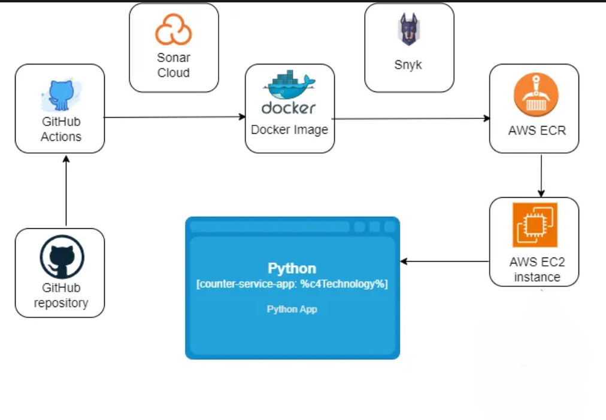

The app looks like:

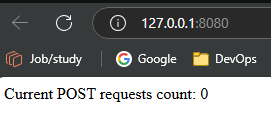

## Prerequisites

- CI/CD
- git
- GitHub action
- AWS ECR
- AWS EC2
- Docker
- docker-compose
- Dockerfile
- Sonar cloud
- Snyk

## Goals

Create a "counter-service" type of service.
It need to keep track of the number of POST requests it has fulfilled on a webpage and provide that information for each GET request it receives.

The code should be as straightforward as feasible while yet being reliable and well-documented.

It is necessary to expose the counter-service on port 80.

Create a Docker image of the counter-service and deploy it to the EC2 instance in the form of a Docker container.

When re-deploying a service, a brief service outage is permissible.

Upon commit & push, the code should pass CI/CD and end up as a running Docker container on the EC2 instance.

## Steps

1. Create GitHub repository
2. Develop the counter-service app in Python, run it, locally.
3. Create a Dockerfile for the counter-service app, build an image, run it and test it locally.
4. Create an EC2 Ubuntu instance for the counter-service app and install Docker on it
5. Push the code to Github repo.
6. Create an ECR repo.
7. Code GitHub Actions for CI [build the image and push it to ECR].
8. Add the Sonar cloud Snyk tests to CI.
9. Code GitHub Actions for CD (pull the image from the ECR to the EC2 instance and run it using Docker Compose).

### 1. Create GitHub repository.

Create new repo with the customize name and start creating or copying files on it.

### 2. Develop the counter-service app in Python, run it.

Create ``` counter-service.py ``` file

This file contains four functions:

a. read_counter—reads and returns the current counter value from the file. If the file doesn’t exist, it returns 0.    

b. update_counter—updates the counter file with the new counter value.

c. handle_request—handles GET and POST requests to the root endpoint.
   GET request returns the current count of POST requests.
   POST request increments the counter and returns the updated count.  

d. health_check—performs a simple health check of the application.
   It tries to read the counter file as a basic check.

The downside of this repo is that there is no database to store the counter value.
NoSQL database or an in-memory datastore to maintain the counter state, or both.

For the count number to reset:
- On every container restart, remove the volume.
- On the new image version release, achieve it by adding version tracking to the Docker image and, in the app, implementing logic that runs at startup to compare the current version (from the Docker image) with the version stored in the persistent volume.

Run the ``` counter-service.py ``` file

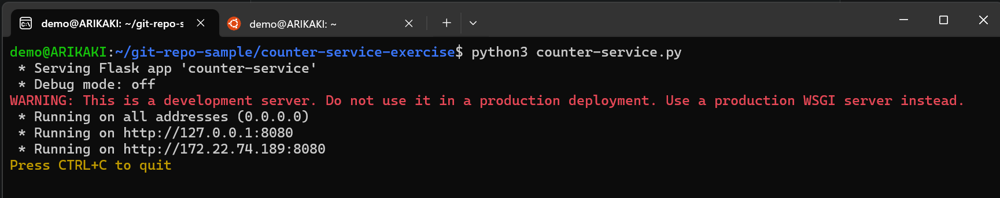

Open the browser and proceed to http://127.0.0.1:8080/. See the POST requests count.

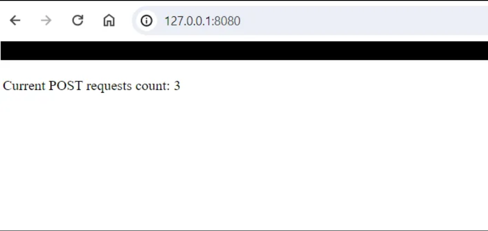

By reaching 127.0.0.1:8080 you sent a GET request.

Try to send a POST to the app.

``` curl -X POST http://127.0.0.1:8080 ```

Refresh the browser (send GET request) and verify that:

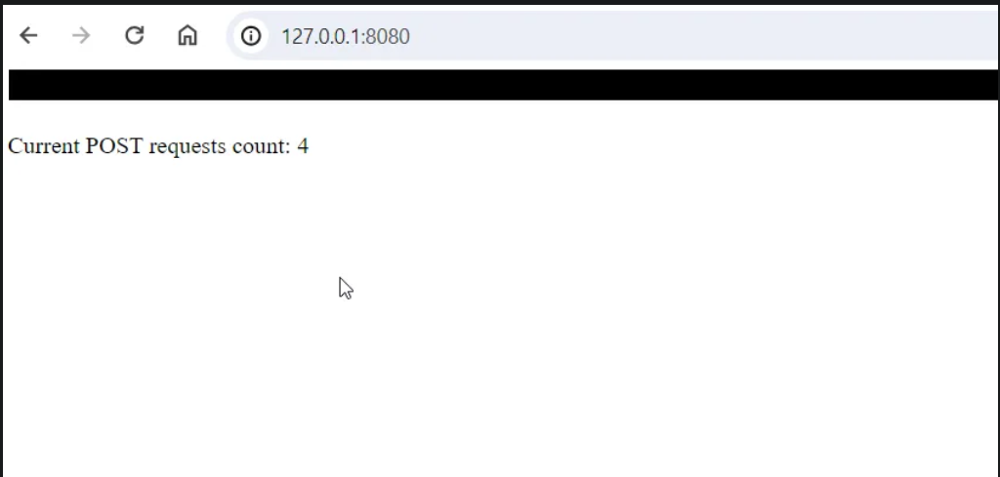

It works locally.

### 3. Create a Dockerfile for the counter-service app, build an image, run it and test it locally.

The easiest way to create the Dockerfile is to use the ``` docker init ``` command. Before that,  create a ``` requirements.txt ``` file for the counter-service application.

``` pip3 freeze > requirements.txt ```
Note: pip3 freeze command includes all packages that are installed with pip install in the environment.

Run the ``` docker init ``` command

Verify the created Dockerfile.

Modify the Dockerfile according to the project.

Build the image:
``` docker build --tag "counter-service-local:1.0.0" . ```

Run the image:
``` docker run -p 3000:8000 counter-service-local:1.0.0 ```

Note: There is an issue with the COUNTER_FILE, defined in the Python app. The volume is not defined, so the application doesn’t work as expected. While trying to POST, an occurs.

### 4. Create an EC2 Ubuntu instance for the counter-service app and install Docker on it

Define the network rules

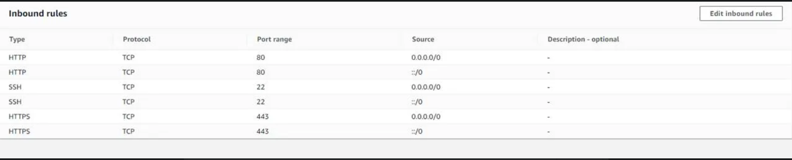

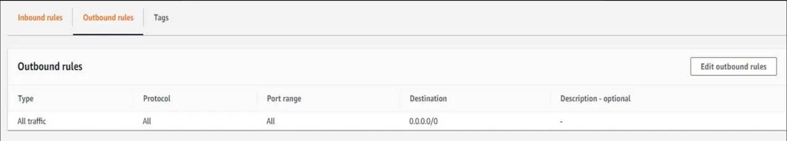

Prepare the EC2 instance for Continuous Deployment.

- Create a docker directory in /home/<user>/. Copy the Docker files inside it.
- Install AWS CLI
- Configure AWS credentials on the instance and login to the ECR: run ``` aws configure ``` command.
- Retrieve an authentication token and authenticate your Docker client to your registry:
    ``` aws ecr get-login-password - region <your-region> | docker login - username AWS - password-stdin <account-id>.dkr.ecr.us-east-1.amazonaws.com ```

Let's push the code in Github.

### 5. Push the code to Github repo.

The main branch in the repository is the default one. Create an additional branch for the tests, name it "dev".

Create a new branch and push to it.

Now create ECR repo for Docker images.

### 6. Create an ECR repo.

Name the ECR repo same as the GitHub repo

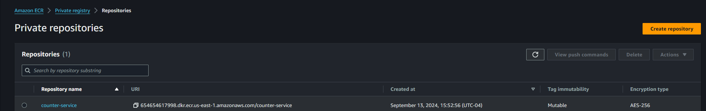

Next step is creating CI.

### 7. Code GitHub actions for CI.

The goal of this step is to create the CI process using GitHub Actions in the following order:

1. Create a new release:
    -    Fetch all tags.

            ``` git fetch --tags ```

    -    Get the latest tag, assume semver, and sort.

            ```
            LATEST_TAG=$(git tag -l | grep -E '^v[0-9]+\.[0-9]+\.[0-9]+$' | sort -V | tail -n1)
            ```


    -    If there’s no tag yet, start with v0.0.0.

            ```
            if [ -z "$LATEST_TAG" ]; then
                LATEST_TAG="v0.0.0"
            fi
            ```
         
    -    Increment the patch version.

            ```
            NEXT_TAG=$(echo $LATEST_TAG | awk -F. '{print $1"."$2"."$3+1}')
            ```


    -    Output the next version.

            ```
            echo "::set-output name=tag::$NEXT_TAG"
            echo "Next version: $NEXT_TAG"
            ```


    -    Create the release.

            ```yaml
            - name: Create Release
              id: create_release
              uses: actions/create-release@v1
              env:
                GITHUB_TOKEN: ${{ secrets.ACCESS_TOKEN_2 }}
              with:
                tag_name: ${{ steps.next_version.outputs.tag }}
                release_name: Release ${{ steps.next_version.outputs.tag }}
                draft: false
                prerelease: false
            ```
 
    
2. Build a Docker image.

    -    Configure AWS credentials.

            ```yaml
            - name: Configure AWS credentials
              uses: aws-actions/configure-aws-credentials@v1
              with:
                aws-access-key-id: ${{ secrets.AWS_ACCESS_KEY_ID }}
                aws-secret-access-key: ${{ secrets.AWS_SECRET_ACCESS_KEY }}
                aws-region: us-east-1
            ```

    -    Login to Amazon ECR.

            ```yaml
            - name: Login to Amazon ECR
              id: login-ecr
              uses: aws-actions/amazon-ecr-login@v1
            ```


    -    Extract the repository name.

            ```yaml
            - name: Extract repository name
            id: repo-name
            run: |
                REPO_NAME="${GITHUB_REPOSITORY##*/}"
                echo "REPO_NAME=$REPO_NAME" >> $GITHUB_ENV
                echo "::set-output name=repo_name::$REPO_NAME"
            ```


    -    Build a Docker image.

            ```yaml
            - name: Build Docker image
              env:
                ECR_REGISTRY: ${{ steps.login-ecr.outputs.registry }}
                ECR_REPOSITORY: ${{ env.REPO_NAME }}
                IMAGE_TAG: ${{ steps.next_version.outputs.tag }}
                run: |
                    docker build -t $ECR_REGISTRY/$ECR_REPOSITORY:$IMAGE_TAG .
                    echo "IMAGE_NAME=$ECR_REGISTRY/$ECR_REPOSITORY:$IMAGE_TAG" >> $GITHUB_ENV
            ```


    -    Push the image to ECR.

            ```yaml
            - name: Push Docker image to Amazon ECR
              env:
              ECR_REGISTRY: ${{ steps.login-ecr.outputs.registry }}
              ECR_REPOSITORY: counter-service-exercise
              IMAGE_TAG: ${{ steps.next_version.outputs.tag }}
              run: |
                # Tag the image as latest
                    docker tag $ECR_REGISTRY/$ECR_REPOSITORY:$IMAGE_TAG $ECR_REGISTRY/$ECR_REPOSITORY:latest
                # Push the specific version tag
                    docker push $ECR_REGISTRY/$ECR_REPOSITORY:$IMAGE_TAG
                # Push the latest tag
                    docker push $ECR_REGISTRY/$ECR_REPOSITORY:latest
            ```

Final GitHub Action for CI:

```yaml
name: Build and Push Docker image to AWS ECR

on:
  push:
    branches:
      - dev

jobs:
  build-and-push:
    runs-on: ubuntu-latest

    steps:
    - name: Check out the repo
      uses: actions/checkout@v2
      with:
        fetch-depth: 0 # Necessary to fetch all tags and history

################################################################
###               DETERMINE NEXT VERSION                     ###
###   Used for creating new releases and image tags          ###
################################################################

    - name: Determine Next Version
      id: next_version
      run: |
        # Fetch all tags
        git fetch --tags
        
        # Get the latest tag, assume semver, and sort.
        LATEST_TAG=$(git tag -l | grep -E '^v[0-9]+\.[0-9]+\.[0-9]+$' | sort -V | tail -n1)
        
        # If there's no tag yet, start with v0.0.0. Used for new repos
        if [ -z "$LATEST_TAG" ]; then
          LATEST_TAG="v0.0.0"
        fi
        
        # Increment the patch version
        NEXT_TAG=$(echo $LATEST_TAG | awk -F. '{print $1"."$2"."$3+1}')
        
        # Output the next version
        echo "::set-output name=tag::$NEXT_TAG"
        echo "Next version: $NEXT_TAG"

################################################################
###                     CREATE RELEASE                       ###
###  Creating release with the tag from the previous step    ###
################################################################

    - name: Create Release
      id: create_release
      uses: actions/create-release@v1
      env:
        GITHUB_TOKEN: ${{ secrets.ACCESS_TOKEN_2 }}
      with:
        tag_name: ${{ steps.next_version.outputs.tag }}
        release_name: Release ${{ steps.next_version.outputs.tag }}
        draft: false
        prerelease: false

################################################################
###                  BUILD DOCKER IMAGE                      ###
###         Build Docker image from the Dockerfile           ###
################################################################

    - name: Configure AWS credentials
      uses: aws-actions/configure-aws-credentials@v1
      with:
        aws-access-key-id: ${{ secrets.AWS_ACCESS_KEY_ID }}
        aws-secret-access-key: ${{ secrets.AWS_SECRET_ACCESS_KEY }}
        aws-region: us-east-1

    - name: Login to Amazon ECR
      id: login-ecr
      uses: aws-actions/amazon-ecr-login@v1

    - name: Extract repository name
      id: repo-name
      run: |
        REPO_NAME="${GITHUB_REPOSITORY##*/}"
        echo "REPO_NAME=$REPO_NAME" >> $GITHUB_ENV
        echo "::set-output name=repo_name::$REPO_NAME"

    - name: Build Docker image
      env:
        ECR_REGISTRY: ${{ steps.login-ecr.outputs.registry }}
        ECR_REPOSITORY: ${{ env.REPO_NAME }}
        IMAGE_TAG: ${{ steps.next_version.outputs.tag }}
      run: |
        docker build -t $ECR_REGISTRY/$ECR_REPOSITORY:$IMAGE_TAG .
        echo "IMAGE_NAME=$ECR_REGISTRY/$ECR_REPOSITORY:$IMAGE_TAG" >> $GITHUB_ENV

###########################################################
###                  PUSH IMAGE TO ECR                  ###
###     Tag Docker image as "latest" and push to ECR    ###
########################################################### 

    - name: Push Docker image to Amazon ECR
      env:
        ECR_REGISTRY: ${{ steps.login-ecr.outputs.registry }}
        ECR_REPOSITORY: counter-service-dev
        IMAGE_TAG: ${{ steps.next_version.outputs.tag }}
      run: |
        # Tag the image as latest
        docker tag $ECR_REGISTRY/$ECR_REPOSITORY:$IMAGE_TAG $ECR_REGISTRY/$ECR_REPOSITORY:latest
        # Push the specific version tag
        docker push $ECR_REGISTRY/$ECR_REPOSITORY:$IMAGE_TAG
        # Push the latest tag
        docker push $ECR_REGISTRY/$ECR_REPOSITORY:latest
```


GitHub Actions ``` .yml ``` files stored in .github/workflows directory in GitHub repository.

It’s easier to do it on the github.com website, it is accessible in the Marketplace for Actions.

Once in the repository, press Actions > Simple Workflow.

GitHub will create a file with the minimum necessary structure.   

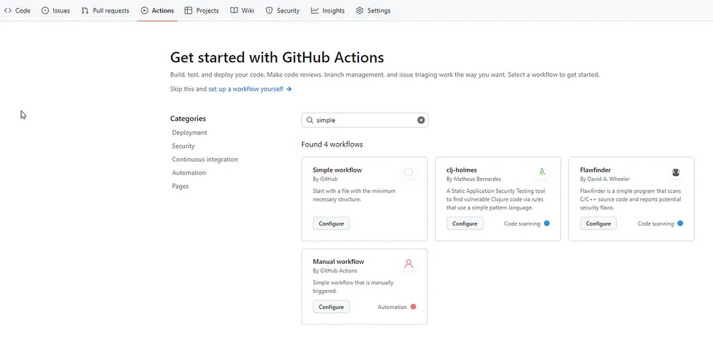

In the code that has been generated by default, change the push to "dev" instead of "main". 

Push to dev will be a trigger on which GitHub Action will start.


Use the following secrets in this order:
- GITHUB_TOKEN: ${{ secrets.ACCESS_TOKEN_2 }}
- aws-access-key-id: ${{ secrets.AWS_ACCESS_KEY_ID }}
- aws-secret-access-key: ${{ secrets.AWS_SECRET_ACCESS_KEY }}

Create roel for the already exisiting IAM user or create new IAM user and assign necccesary permission i.e. [AmazonEC2ContainerRegistryPowerUser]

Save the AWS_ACCESS_KEY_ID and the AWS_SECRET_ACCESS_KEY as GitHub repository secrets.

Its preferred to have a personal access GitHub token.

Push the GitHub Actions code to the dev branch and see if the image will be delivered to ECR by executing GutHub Action.

See the GitHub Actions output in real-time in the Actions tab.

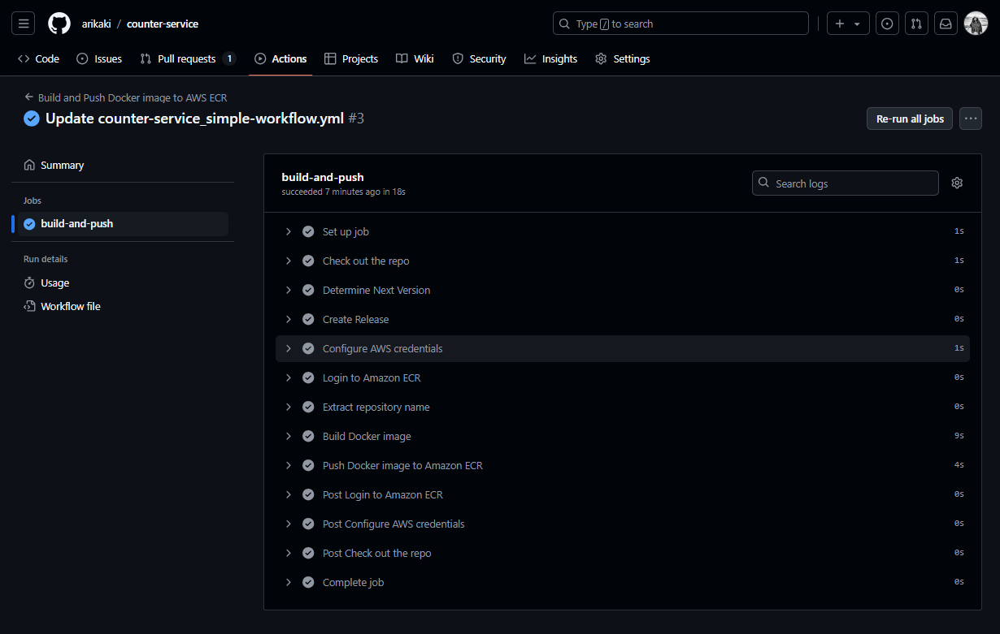

Check the ECR, the image has been added in the ECR repo

Now let’s add the code and vulnerability tests to your GitHub Action.


### 8. Add the Sonar cloud Snyk tests to CI.

The Sonar Cloud scans the code for bugs or vulnerabilities. Snyk scans the code and the base Docker image from the Dockerfile for vulnerabilities.

Sonar Cloud:
- Login with your GitHub account to Sonar Cloud.
- Press + on the right upper corner, then press Analyze new project.
- Search for your project, select it.
- Choose Previous version and press Create project.
- Choose GitHub Action as Analysis Method.

Get exact instructions on what needed to do in order to run the Sonar Cloud test with GitHub Actions.

Create a new SONAR_TOKEN secret, copy the SonarCloud step to your GitHub Actions yml file, and create a ``` sonar-project.properties ``` file.

SonarCloud step:

```yaml
- name: SonarCloud Scan
  uses: SonarSource/sonarcloud-github-action@master
  env:
    GITHUB_TOKEN: ${{ secrets.GITHUB_TOKEN }}
    SONAR_TOKEN: ${{ secrets.SONAR_TOKEN }}

- name: Setup Git
  run: |
    git config --global user.name 'github-actions'
    git config --global user.email 'github-actions@github.com'
```

Make sure the Automatic Analysis is off in Administration/Analysis Method.

Snyk:
- Login to https://snyk.io/ with GitHub.
- Press “Add project ”on the right upper corner > GitHub, choose your repository, and press “Add selected repository.”

Snyk step:

```yaml
- name: Run Snyk to check Docker image for vulnerabilities
  uses: snyk/actions/docker@master
  env:
    SNYK_TOKEN: ${{ secrets.SNYK_TOKEN }}
  with:
    image: ${{ env.IMAGE_NAME }}
    args: --severity-threshold=high --policy-path=.snyk
  continue-on-error: false
```

Updated GitHub Action that includes SonarCloud and Snyk:

``` yaml
name: Build and Push Docker image to AWS ECR

on:
  push:
    branches:
      - dev

jobs:
  build-and-push:
    runs-on: ubuntu-latest

    steps:
    - name: Check out the repo
      uses: actions/checkout@v2
      with:
        fetch-depth: 0 # Necessary to fetch all tags and history

################################################################
###               SONAR CLOUD SCAN                           ###
### Drops the build if any bugs or vulnerabilities are found.###
###            Using the default quality gate.               ###
###        Connected to my personal Sonar Cloud account      ###
################################################################

    - name: SonarCloud Scan
      uses: SonarSource/sonarcloud-github-action@master
      env:
        GITHUB_TOKEN: ${{ secrets.GITHUB_TOKEN }}
        SONAR_TOKEN: ${{ secrets.SONAR_TOKEN }}

    - name: Setup Git
      run: |
        git config --global user.name 'github-actions'
        git config --global user.email 'github-actions@github.com'

################################################################
###               DETERMINE NEXT VERSION                     ###
###   Used for creating new releases and image tags          ###
################################################################

    - name: Determine Next Version
      id: next_version
      run: |
        # Fetch all tags
        git fetch --tags
        
        # Get the latest tag, assume semver, and sort.
        LATEST_TAG=$(git tag -l | grep -E '^v[0-9]+\.[0-9]+\.[0-9]+$' | sort -V | tail -n1)
        
        # If there's no tag yet, start with v0.0.0. Used for new repos
        if [ -z "$LATEST_TAG" ]; then
          LATEST_TAG="v0.0.0"
        fi
        
        # Increment the patch version
        NEXT_TAG=$(echo $LATEST_TAG | awk -F. '{print $1"."$2"."$3+1}')
        
        # Output the next version
        echo "::set-output name=tag::$NEXT_TAG"
        echo "Next version: $NEXT_TAG"

################################################################
###                     CREATE RELEASE                       ###
###  Creating release with the tag from the previous step    ###
################################################################

    - name: Create Release
      id: create_release
      uses: actions/create-release@v1
      env:
        GITHUB_TOKEN: ${{ secrets.ACCESS_TOKEN_2 }}
      with:
        tag_name: ${{ steps.next_version.outputs.tag }}
        release_name: Release ${{ steps.next_version.outputs.tag }}
        draft: false
        prerelease: false

################################################################
###                  BUILD DOCKER IMAGE                      ###
###         Build Docker image from the Dockefile            ###
################################################################

    - name: Configure AWS credentials
      uses: aws-actions/configure-aws-credentials@v1
      with:
        aws-access-key-id: ${{ secrets.AWS_ACCESS_KEY_ID }}
        aws-secret-access-key: ${{ secrets.AWS_SECRET_ACCESS_KEY }}
        aws-region: us-east-1

    - name: Login to Amazon ECR
      id: login-ecr
      uses: aws-actions/amazon-ecr-login@v1

    - name: Extract repository name
      id: repo-name
      run: |
        REPO_NAME="${GITHUB_REPOSITORY##*/}"
        echo "REPO_NAME=$REPO_NAME" >> $GITHUB_ENV
        echo "::set-output name=repo_name::$REPO_NAME"

    - name: Build Docker image
      env:
        ECR_REGISTRY: ${{ steps.login-ecr.outputs.registry }}
        ECR_REPOSITORY: ${{ env.REPO_NAME }}
        IMAGE_TAG: ${{ steps.next_version.outputs.tag }}
      run: |
        docker build -t $ECR_REGISTRY/$ECR_REPOSITORY:$IMAGE_TAG .
        echo "IMAGE_NAME=$ECR_REGISTRY/$ECR_REPOSITORY:$IMAGE_TAG" >> $GITHUB_ENV

###########################################################
###  Docker image Snyk scan | If fails, drop the action ###
###       Connected to my personal Snyk account         ###
###     The code owner receives an email notification   ###
### Possible to configure Slack notification if needed  ###
###########################################################               
               
    - name: Run Snyk to check Docker image for vulnerabilities
      uses: snyk/actions/docker@master
      env:
        SNYK_TOKEN: ${{ secrets.SNYK_TOKEN }}
      with:
         image: ${{ env.IMAGE_NAME }}
         args: --severity-threshold=high --policy-path=.snyk
      continue-on-error: false

###########################################################
###                   PUSH IMAGE TO ECR                 ###
###     Tag Docker image as "latest" and push to ECR    ###
########################################################### 

    - name: Push Docker image to Amazon ECR
      env:
        ECR_REGISTRY: ${{ steps.login-ecr.outputs.registry }}
        ECR_REPOSITORY: counter-service-dev
        IMAGE_TAG: ${{ steps.next_version.outputs.tag }}
      run: |
        # Tag the image as latest
        docker tag $ECR_REGISTRY/$ECR_REPOSITORY:$IMAGE_TAG $ECR_REGISTRY/$ECR_REPOSITORY:latest
        # Push the specific version tag
        docker push $ECR_REGISTRY/$ECR_REPOSITORY:$IMAGE_TAG
        # Push the latest tag
        docker push $ECR_REGISTRY/$ECR_REPOSITORY:latest
```

Push to dev branch and verify it’s working.

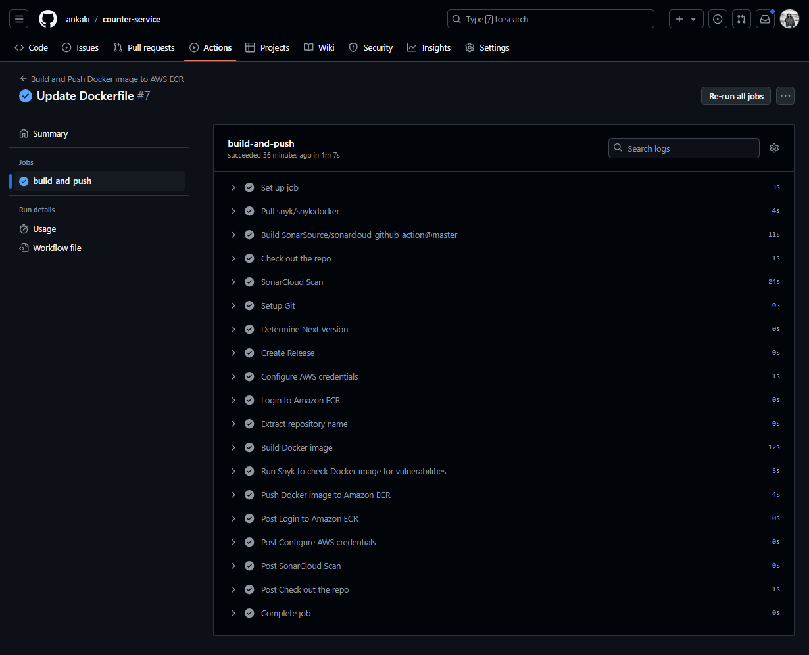

All is set, it’s time to create a CD.


### 9. Code GitHub Actions for CD (pull the image from the ECR to the EC2 instance and run it using Docker Compose).

Pull the image from the ECR to the EC2 instance and run it.

To pull the image from the ECR, define and save as GitHub Action Secrets the following parameters:

- EC2 instance PEM key to connect to it (EC2_PEM_KEY).
- EC2 instance IP address or hostname (EC2_HOST).
- EC2 instance user (EC2_USER). The default user for Ubuntu servers is ``` ubuntu ```.

GitHub Action step for CD:

``` yaml
- name: Deploy to EC2
      env:
        EC2_PEM_KEY: ${{ secrets.EC2_PEM_KEY }}
        EC2_HOST: ${{ secrets.EC2_HOST }}
        EC2_USER: ${{ secrets.EC2_USER }}
        ECR_REGISTRY: ${{ steps.login-ecr.outputs.registry }}
        ECR_REPOSITORY: counter-service-exercise
        IMAGE_TAG: ${{ steps.next_version.outputs.tag }}
      run: |
        # Save PEM key to file and set permissions
        echo "$EC2_PEM_KEY" > ec2.pem
        chmod 400 ec2.pem

        # SSH, SCP commands
        SSH_COMMAND="ssh -i ec2.pem -o StrictHostKeyChecking=no $EC2_USER@$EC2_HOST"
        SCP_COMMAND="scp -i ec2.pem -o StrictHostKeyChecking=no"

        #Login to the Docker Registry (ECR)
        $SSH_COMMAND "aws ecr get-login-password --region us-east-1 | docker login --username AWS --password-stdin $ECR_REGISTRY"
        
        # Copy docker-compose.yml to EC2 server
        $SCP_COMMAND docker-compose.yml $EC2_USER@$EC2_HOST:/home/centos/docker/
        
        # Pull and run the Docker container on EC2
        $SSH_COMMAND "cd /home/ubuntu/docker/ && docker pull $ECR_REGISTRY/$ECR_REPOSITORY:$IMAGE_TAG && docker compose -f docker-compose.yml up -d --force-recreate"
        
        # Cleanup PEM key
        rm -f ec2.pem
```

[ Note: The step “Login to the Docker Registry (ECR)”. its going to need it because the ECR login lasts for 12 hours only. ]

The GitHub Action will also copy docker-compose.yml from the GitHub repository to the EC2 server. So add this file to the GitHub repository.

Here is docker-compose.yml:

``` yaml
version: '2.4'  # The last version of Docker Compose file format that directly supports mem_limit and cpus
services:
  counter-service:
    container_name: counter-service-exercise
    image: <aws account id>.dkr.ecr.us-east-1.amazonaws.com/counter-service-exercise:latest
    volumes:
      - ./data:/data
    ports:
      - "80:8080"
    restart: always
    mem_limit: 256M
    cpus: 0.5
```

Final GitHub Action file:

``` yaml
name: Build and Push Docker image to AWS ECR

on:
  push:
    branches:
      - dev

jobs:
  build-and-push:
    runs-on: ubuntu-latest

    steps:
    - name: Check out the repo
      uses: actions/checkout@v2
      with:
        fetch-depth: 0 # Necessary to fetch all tags and history

################################################################
###               SONAR CLOUD SCAN                           ###
### Drops the build if any bugs or vulnerabilities are found.###
###            Using the default quality gate.               ###
###        Connected to my personal Sonar Cloud account      ###
################################################################

    - name: SonarCloud Scan
      uses: SonarSource/sonarcloud-github-action@master
      env:
        GITHUB_TOKEN: ${{ secrets.GITHUB_TOKEN }}
        SONAR_TOKEN: ${{ secrets.SONAR_TOKEN }}

    - name: Setup Git
      run: |
        git config --global user.name 'github-actions'
        git config --global user.email 'github-actions@github.com'

################################################################
###               DETERMINE NEXT VERSION                     ###
###   Used for creating new releases and image tags          ###
################################################################

    - name: Determine Next Version
      id: next_version
      run: |
        # Fetch all tags
        git fetch --tags
        
        # Get the latest tag, assume semver, and sort.
        LATEST_TAG=$(git tag -l | grep -E '^v[0-9]+\.[0-9]+\.[0-9]+$' | sort -V | tail -n1)
        
        # If there's no tag yet, start with v0.0.0. Used for new repos
        if [ -z "$LATEST_TAG" ]; then
          LATEST_TAG="v0.0.0"
        fi
        
        # Increment the patch version
        NEXT_TAG=$(echo $LATEST_TAG | awk -F. '{print $1"."$2"."$3+1}')
        
        # Output the next version
        echo "::set-output name=tag::$NEXT_TAG"
        echo "Next version: $NEXT_TAG"

################################################################
###                     CREATE RELEASE                       ###
###  Creating release with the tag from the previous step    ###
################################################################

    - name: Create Release
      id: create_release
      uses: actions/create-release@v1
      env:
        GITHUB_TOKEN: ${{ secrets.ACCESS_TOKEN_2 }}
      with:
        tag_name: ${{ steps.next_version.outputs.tag }}
        release_name: Release ${{ steps.next_version.outputs.tag }}
        draft: false
        prerelease: false

################################################################
###                  BUILD DOCKER IMAGE                      ###
###         Build Docker image from the Dockefile            ###
################################################################

    - name: Configure AWS credentials
      uses: aws-actions/configure-aws-credentials@v1
      with:
        aws-access-key-id: ${{ secrets.AWS_ACCESS_KEY_ID }}
        aws-secret-access-key: ${{ secrets.AWS_SECRET_ACCESS_KEY }}
        aws-region: us-east-1

    - name: Login to Amazon ECR
      id: login-ecr
      uses: aws-actions/amazon-ecr-login@v1

    - name: Extract repository name
      id: repo-name
      run: |
        REPO_NAME="${GITHUB_REPOSITORY##*/}"
        echo "REPO_NAME=$REPO_NAME" >> $GITHUB_ENV
        echo "::set-output name=repo_name::$REPO_NAME"

    - name: Build Docker image
      env:
        ECR_REGISTRY: ${{ steps.login-ecr.outputs.registry }}
        ECR_REPOSITORY: ${{ env.REPO_NAME }}
        IMAGE_TAG: ${{ steps.next_version.outputs.tag }}
      run: |
        docker build -t $ECR_REGISTRY/$ECR_REPOSITORY:$IMAGE_TAG .
        echo "IMAGE_NAME=$ECR_REGISTRY/$ECR_REPOSITORY:$IMAGE_TAG" >> $GITHUB_ENV

###########################################################
###  Docker image Snyk scan | If fails, drop the action ###
###       Connected to my personal Snyk account         ###
###     The code owner receives an email notification   ###
### Possible to configure Slack notification if needed  ###
###########################################################               
               
    - name: Run Snyk to check Docker image for vulnerabilities
      uses: snyk/actions/docker@master
      env:
        SNYK_TOKEN: ${{ secrets.SNYK_TOKEN }}
      with:
         image: ${{ env.IMAGE_NAME }}
         args: --severity-threshold=high --policy-path=.snyk
      continue-on-error: false

###########################################################
###         PUSH IMAGE TO ECR AND DEPLOY TO EC2         ###
###     Tag Docker image as "latest" and push to ECR    ###
###               Deploy to EC2 using SSH               ###
########################################################### 

    - name: Push Docker image to Amazon ECR
      env:
        ECR_REGISTRY: ${{ steps.login-ecr.outputs.registry }}
        ECR_REPOSITORY: counter-service-dev
        IMAGE_TAG: ${{ steps.next_version.outputs.tag }}
      run: |
        # Tag the image as latest
        docker tag $ECR_REGISTRY/$ECR_REPOSITORY:$IMAGE_TAG $ECR_REGISTRY/$ECR_REPOSITORY:latest
        # Push the specific version tag
        docker push $ECR_REGISTRY/$ECR_REPOSITORY:$IMAGE_TAG
        # Push the latest tag
        docker push $ECR_REGISTRY/$ECR_REPOSITORY:latest

    - name: Deploy to EC2
      env:
        EC2_PEM_KEY: ${{ secrets.EC2_PEM_KEY }}
        EC2_HOST: ${{ secrets.EC2_HOST }}
        EC2_USER: ${{ secrets.EC2_USER }}
        ECR_REGISTRY: ${{ steps.login-ecr.outputs.registry }}
        ECR_REPOSITORY: counter-service-dev
        IMAGE_TAG: ${{ steps.next_version.outputs.tag }}
      run: |
        # Save PEM key to file and set permissions
        echo "$EC2_PEM_KEY" > ec2.pem
        chmod 400 ec2.pem

        # SSH, SCP commands
        SSH_COMMAND="ssh -i ec2.pem -o StrictHostKeyChecking=no $EC2_USER@$EC2_HOST"
        SCP_COMMAND="scp -i ec2.pem -o StrictHostKeyChecking=no"

        #Login to Docker registry
        $SSH_COMMAND "aws ecr get-login-password --region us-east-1 | docker login --username AWS --password-stdin $ECR_REGISTRY"
        
        # Copy docker-compose.yml to EC2 server
        $SCP_COMMAND docker-compose.yml $EC2_USER@$EC2_HOST:/home/ubuntu/docker/
        
        # Pull and run the Docker container on EC2
        $SSH_COMMAND "cd /home/ubuntu/docker/docker-compose.yml && docker pull $ECR_REGISTRY/$ECR_REPOSITORY:$IMAGE_TAG && docker compose -f docker-compose.yml up -d --force-recreate"
        
        # Cleanup PEM key
        rm -f ec2.pem
```

Push the changes to the dev branch and verify CI/CD works.

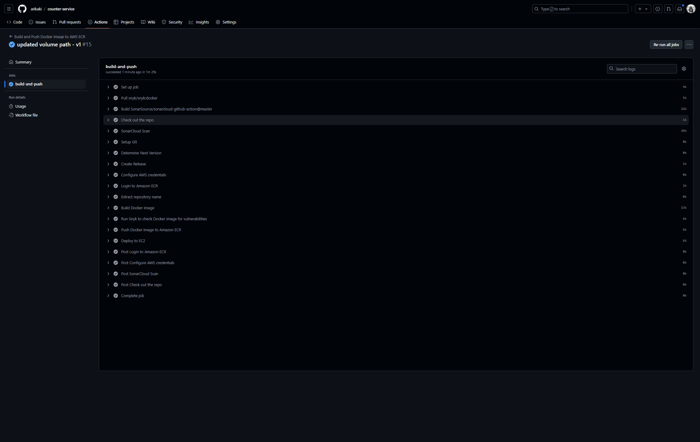

Check the Sonarcloud:

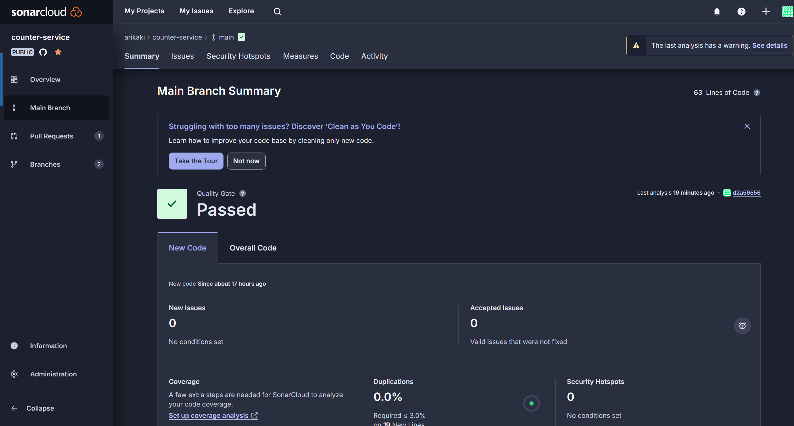

Check ECR repo:

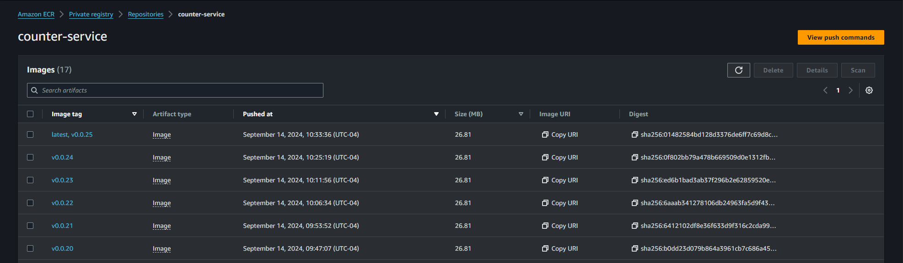

Check container in EC2 instance:

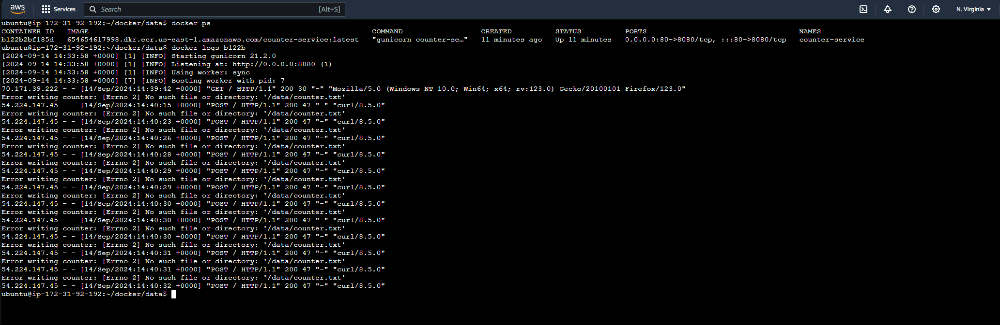

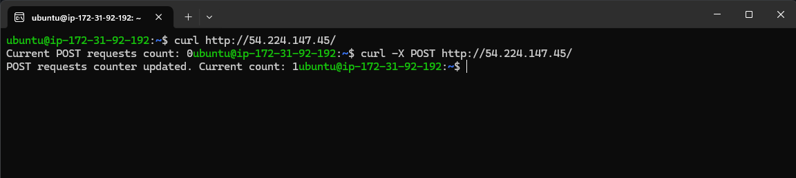

Try to POST to the app now, an error occurs:
``` PermissionError: [Errno 13] Permission denied: ‘/data/counter.txt’ ```

This is because the application, running inside a Docker container, does not have the necessary permissions to write to the file /data/counter.txt. There is a mismatch between the user ID (UID) of the process inside the container and the ownership or permissions of the mounted volume on the host machine.

NoSQL database can be used to tackle this problem.

Now, in order to make it work during the push to the main branch, replace the branch name on the top of the yml file.

``` yaml
on:
  push:
    branches:
      - main
```